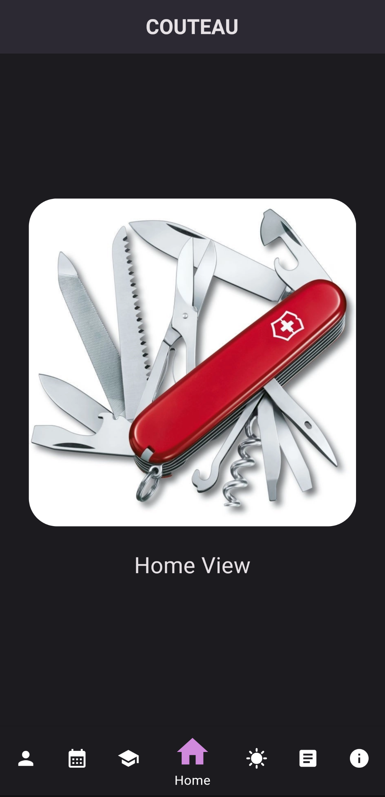
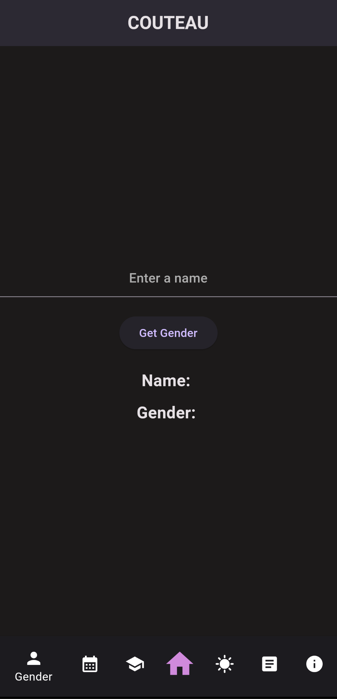
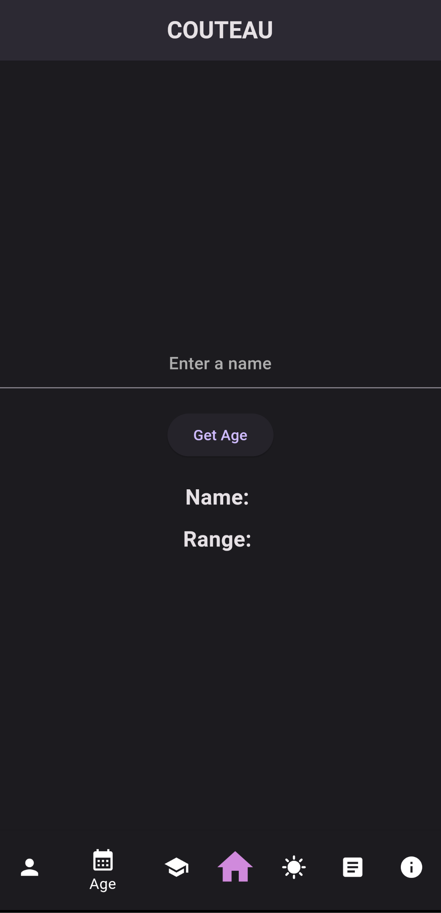
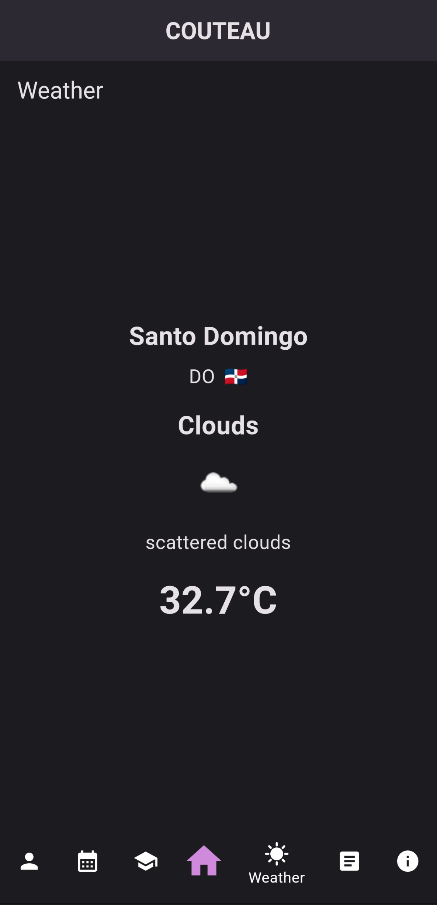
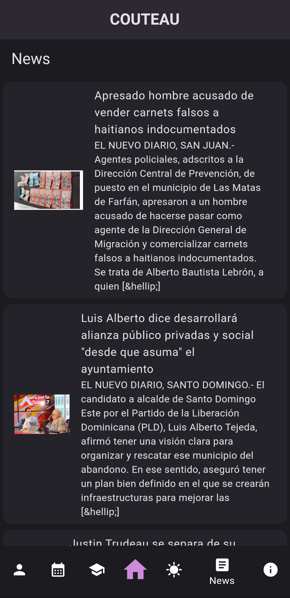

# ***Couteau App***

## Descripción
Aplicación creada en Flutter.
Consiste en un conjunto de herramientas aplicadas a traves de diferentes API's.
Esta aplicación muestra 7 vistas principales que consumen diferentes APIs externas. A continuación se describe cada una de las vistas:

### Home
Esta es la vista principal de la aplicación.
Muestra una imagen y el título de la vista.

### Géneros
En esta vista, se muestra si un nombre es masculino o femenino.
Utiliza la API [Genderize](https://api.genderize.io/?name=maria)

### Edad
Esta vista estima si un nombre es de una persona anciana, adulta o joven.
Utiliza la API [Agify](https://api.agify.io/?name=maria)

### Universidad
En esta vista, se muestra una lista de universidades, su dominio y enlace correspondiente a un país específico.
Utiliza la API [Universities de Hipolabs](http://universities.hipolabs.com/search?country=Dominican+Republic)

### Clima
Esta vista muestra el clima actual, temperatura y descripción de la ciudad establecida (ciudad por defecto Santo Domingo).
Utiliza la API  OpenWeather. _https://api.openweathermap.org/data/2.5/weather?q=Santo+Domingo,Dominican+Republic&APPID="YOUR API KEY HERE"_

### Noticias
En esta vista, se muestran las últimas noticias obtenidas de un periódico digital utilizando su API correspondiente.
Utiliza la API WordPress de el periódico digital [El nuevo Diario](https://elnuevodiario.com.do/wp-json/wp/v2/posts)

### About
En esta vista, se muestra información del perfil de GitHub.
Utiliza la API de [GitHub](https://api.github.com/users/2mingho/repos)

## Screenshots

